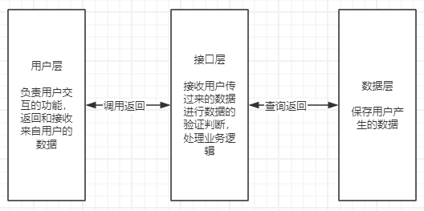

# 选课系统

这是一个选课系统，使用了三层架构，和面向对象的方法编写。

## 三层架构



## 实现的顺序

1. 根据需求文档先实现用户层的编写，在代码中主要体现在各个功能的展示.
2. 管理员 -> 老师 -> 学生

## 1、需求分析

```text
1. 创建北京、上海 2 所学校
   学校类对象
   属性:名字,地址
   行为:

2. 创建linux , python , go 3个课程 ， linux\py 在北京开， go 在上海开

3. 课程包含，周期，价格，通过学校创建课程 
   课程类对象
       属性:名字,价格,周期
       行为:

4. 通过学校创建班级， 班级关联课程、讲师
   班级对象
   属性:名字, 课程名称

   讲师对象
   属性:名字,密码,校区名称,课程名称

5. 创建学员时，选择学校，关联班级
   学生对象:
   属性:名字,密码 ,学校名称,班级名称,成绩

6. 创建讲师角色时要关联学校

7. 提供三个角色接口
   7.1 学员视图， 可以注册，登陆, 交学费， 选择班级,查看成绩

   7.2 讲师视图,登陆,(注册没有 由管理员来分配账号)， 查看班级学员列表 ， 修改所管理的学员的成绩,修改密码

   7.3 管理视图，登陆,创建学校,创建讲师， 创建班级，创建课程,给老师指定班级。
       管理员通过调代码接口自动注册初始的管理员用户。

8. 上面的操作产生的数据都通过pickle序列化保存到文件里。

实现的顺序
管理员  老师  学员
```

默认管理员账号:admin
密码:123

## 启动方式

```bash
python bin/start.py
```

